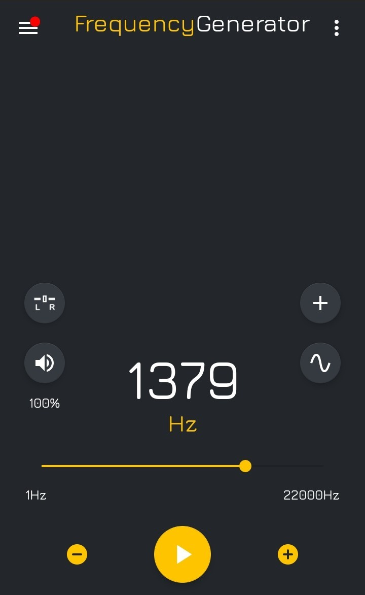

# 🎵 Audio Analyzer App  

**Audio Analyzer App** is a MATLAB-based tool that records audio, visualizes the waveform and frequency spectrum, and identifies the dominant frequency in real time.  

## 📷 User Interface  
  

## 📷 Audio Generator  
  

## 🚀 Features  
- Records audio (5 seconds, 44.1 kHz and 16-bit).  
- Displays the waveform of the recorded audio.  
- Performs FFT to analyze the frequency spectrum.  
- Identifies and displays the dominant frequency.  

## 🛠 How to Use  
1. Run the `Code_with_UI_Interface.m` file in MATLAB.  
2. Click the **Start Recording** button to begin.  
3. View the waveform, spectrum, and dominant frequency.
4. For core implementation without the UI, please check the file "Code_without_UI_Interface.m", where the main logic is written for simplicity.

## 📜 Requirements  
- MATLAB with App Designer support.  
